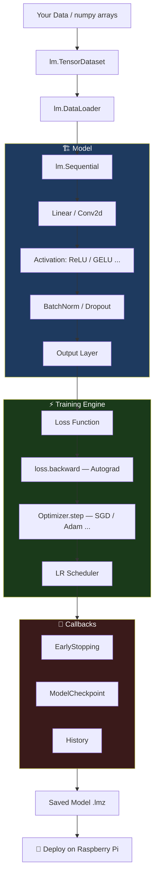

<div align="center">


<br/>

# ⚡ LowMind

### Ultra-Lightweight Deep Learning Framework

**Deep Learning on Raspberry Pi and Low-End Devices — Made Effortless**

<br/>

[](https://pypi.org/project/lowmind/)
[](https://www.python.org/)
[](LICENSE)
[](https://github.com/dhaval-vedra/lowmind)
[](https://pypi.org/project/lowmind/)

[](https://www.raspberrypi.org/)
[](https://www.linux.org/)
[](https://www.apple.com/macos/)
[](https://www.microsoft.com/windows/)

<br/>

> *"Democratizing Deep Learning for Resource-Constrained Environments"*

<br/>

```bash
pip install lowmind
```

<br/>

</div>

---

## 🤔 Why LowMind?

<div align="center">

| | **PyTorch** | **TensorFlow** | **⚡ LowMind** |
|:---:|:---:|:---:|:---:|
| **Install Size** | ~2.5 GB | ~600 MB | **~3 MB** |
| **Dependencies** | 50+ | 30+ | **2 (numpy, psutil)** |
| **Raspberry Pi** | ❌ Painful | ⚠️ Limited | **✅ Native** |
| **PyTorch-like API** | ✅ | ❌ | **✅** |
| **Autograd** | ✅ | ✅ | **✅** |
| **Zero CUDA required** | ❌ | ❌ | **✅** |

</div>

LowMind gives you a **PyTorch-like API** built purely on NumPy — no multi-GB installation, no CUDA, no cloud required. Train real neural networks on a **$35 Raspberry Pi Zero**.

---

## ✨ Features at a Glance

<div align="center">

```
┌─────────────────────────────────────────────────────────────────┐
│                        LOWMIND v2.0                             │
├──────────────────┬──────────────────────────────────────────────┤
│  🧠 Autograd     │  Reverse-mode autodiff · Broadcasting ·      │
│                  │  Tuple-axis support                          │
├──────────────────┼──────────────────────────────────────────────┤
│  🏗️  Layers      │  Linear · Conv2d · BatchNorm · MaxPool ·     │
│                  │  AvgPool · Flatten · Dropout · Embedding     │
├──────────────────┼──────────────────────────────────────────────┤
│  ⚡ Activations  │  ReLU · LeakyReLU · ELU · GELU · Sigmoid ·  │
│                  │  Tanh · Softmax · LogSoftmax                 │
├──────────────────┼──────────────────────────────────────────────┤
│  📉 Loss Fns     │  CrossEntropy · BCE · MSE · MAE · Huber · NLL│
├──────────────────┼──────────────────────────────────────────────┤
│  🚀 Optimizers   │  SGD · Adam · AdamW · RMSprop · AdaGrad     │
├──────────────────┼──────────────────────────────────────────────┤
│  📅 Schedulers   │  StepLR · Cosine · ReduceOnPlateau ·         │
│                  │  CyclicLR · LinearWarmup · MultiStepLR       │
├──────────────────┼──────────────────────────────────────────────┤
│  📦 Data         │  Dataset · TensorDataset · DataLoader ·      │
│                  │  train_test_split                            │
├──────────────────┼──────────────────────────────────────────────┤
│  📊 Metrics      │  Accuracy · Precision · Recall · F1 ·        │
│                  │  Confusion Matrix · R² · MSE · MAE           │
├──────────────────┼──────────────────────────────────────────────┤
│  🎯 Trainer      │  High-level loop · Callbacks · Grad Clip ·   │
│                  │  Validation · EarlyStopping · Checkpointing  │
├──────────────────┼──────────────────────────────────────────────┤
│  🤖 Models       │  MicroMLP · MicroCNN · TinyResNet            │
├──────────────────┼──────────────────────────────────────────────┤
│  🖥️  Monitor     │  SystemMonitor · memory_trace · health_score │
└──────────────────┴──────────────────────────────────────────────┘
```

</div>

---

## 📦 Installation

<details open>
<summary><b>🌐 From PyPI (Recommended)</b></summary>

```bash
pip install lowmind
```

</details>

<details>
<summary><b>🛠️ From Source</b></summary>

```bash
git clone https://github.com/dhaval-vedra/lowmind.git
cd lowmind
pip install -e .
```

</details>

<details>
<summary><b>🍓 Raspberry Pi (System Packages)</b></summary>

```bash
sudo apt update
sudo apt install python3-pip python3-numpy python3-psutil
pip3 install lowmind
```

</details>

**Requirements:** `numpy>=1.19.0` · `psutil>=5.8.0` — that's it.

---

## 🚀 Quick Start

```python
import lowmind as lm
import numpy as np

# ── 1. Build a model ───────────────────────────────────────────────
model = lm.Sequential(
    lm.Linear(784, 128),
    lm.ReLU(),
    lm.Dropout(0.3),
    lm.Linear(128, 10),
)

# ── 2. Optimizer ───────────────────────────────────────────────────
optimizer = lm.Adam(model.parameters(), lr=1e-3)

# ── 3. Data ────────────────────────────────────────────────────────
X = np.random.randn(1000, 784).astype(np.float32)
y = np.random.randint(0, 10, 1000)
loader = lm.DataLoader(lm.TensorDataset(X, y), batch_size=64, shuffle=True)

# ── 4. Training loop ───────────────────────────────────────────────
for epoch in range(20):
    model.train()
    for X_batch, y_batch in loader:
        optimizer.zero_grad()
        output  = model(X_batch)
        loss    = lm.cross_entropy_loss(output, y_batch)
        loss.backward()
        optimizer.step()
    print(f"Epoch {epoch+1:02d} ✓")
```

---

## 🏛️ Architecture



---

## 📚 Table of Contents

- [Tensors & Autograd](#-tensors--autograd)
- [Layers & Modules](#-layers--modules)
- [Loss Functions](#-loss-functions)
- [Optimizers](#-optimizers)
- [LR Schedulers](#-lr-schedulers)
- [Data Utilities](#-data-utilities)
- [Metrics](#-metrics)
- [Trainer](#-trainer)
- [Callbacks](#-callbacks)
- [Pre-built Models](#-pre-built-models)
- [System Monitor](#-system-monitor)
- [Examples](#-examples)
- [Project Structure](#-project-structure)
- [Raspberry Pi Tips](#-raspberry-pi-tips)
- [Contributing](#-contributing)

---

## 🔢 Tensors & Autograd

`lm.Tensor` is LowMind's core — an N-dimensional array with **automatic gradient tracking**.

### Creating Tensors

```python
import lowmind as lm
import numpy as np

t = lm.Tensor([1.0, 2.0, 3.0])                      # from list
t = lm.Tensor(np.array([[1, 2], [3, 4]]))            # from numpy
t = lm.Tensor(5.0, requires_grad=True)               # scalar with grad

# Factory functions
lm.zeros(3, 4)        # zeros
lm.ones(2, 2)         # ones
lm.randn(10, 10)      # standard normal
lm.rand(5, 5)         # uniform [0, 1]
lm.arange(0, 10, 2)  # [0, 2, 4, 6, 8]
lm.from_numpy(arr)    # wrap numpy array
```

### Arithmetic & Reductions

```python
a = lm.Tensor([1., 2., 3.], requires_grad=True)
b = lm.Tensor([4., 5., 6.], requires_grad=True)

c = a + b;  c = a - b;  c = a * b   # element-wise
c = a / b;  c = a ** 2; c = a @ b   # divide, power, matmul

x = lm.Tensor([[1., 2.], [3., 4.]])
x.sum()                          # 10.0
x.sum(axis=0)                    # [4., 6.]
x.mean(axis=(2, 3))              # tuple-axis (CNN global pooling)
x.max(axis=1)                    # row-wise max
```

### Activations on Tensors

```python
x = lm.Tensor([-2., -1., 0., 1., 2.])

x.relu()             # [0, 0, 0, 1, 2]
x.sigmoid()          # [0.12, 0.27, 0.5, 0.73, 0.88]
x.tanh()             # [-0.96, -0.76, 0, 0.76, 0.96]
x.leaky_relu(0.01)   # leak on negatives
x.gelu()             # gaussian error linear unit
x.softmax(axis=-1)   # probability distribution
x.clip(-1, 1)        # clamp values
```

### Autograd — How it Works

```
Forward pass  ──→  builds computation graph (ops, parents, grads)
                          │
loss.backward() ──→  traverses graph in reverse, accumulates ∂L/∂param
                          │
optimizer.step() ──→  updates weights using accumulated gradients
```

```python
# Example: dy/dx of y = x² + 2x + 1 at x=3
x = lm.Tensor(3.0, requires_grad=True)
y = x**2 + 2*x + 1
y.backward()
print(x.grad)   # → 8.0  (2x + 2 = 8 ✓)

# Multi-variable gradients
a = lm.Tensor([1., 2.], requires_grad=True)
b = lm.Tensor([3., 4.], requires_grad=True)
loss = (a * b).sum()
loss.backward()
print(a.grad)   # → [3., 4.]
print(b.grad)   # → [1., 2.]

# Gradient clipping (essential for training stability)
lm.clip_grad_norm(model.parameters(), max_norm=1.0)
```

### Utility Methods

```python
t.item()     # Python float from 0-d tensor
t.numpy()    # underlying numpy array
t.detach()   # tensor without grad tracking
t.copy()     # full copy including grad
t.shape      # shape tuple
t.ndim       # number of dimensions
t.size       # total number of elements
t.zero_grad()
```

---

## 🏗️ Layers & Modules

All layers are subclasses of `lm.Module` and compose in `lm.Sequential`.

### Core Layers

```python
# Linear (fully-connected)
lm.Linear(in_features=784, out_features=256, bias=True)
# (N, 784) → (N, 256)

# Conv2d
lm.Conv2d(in_channels=3, out_channels=32, kernel_size=3, stride=1, padding=1)
# (N, 3, H, W) → (N, 32, H, W)

# Normalization
lm.BatchNorm1d(256)        # for (N, features)
lm.BatchNorm2d(32)         # for (N, C, H, W)

# Pooling
lm.MaxPool2d(kernel_size=2, stride=2)   # halves spatial dims
lm.AvgPool2d(kernel_size=2)

# Utility
lm.Flatten(start_dim=1)    # (N, C, H, W) → (N, C*H*W)
lm.Dropout(p=0.5)          # auto-disabled at eval()
lm.Embedding(num_embeddings=10000, embedding_dim=128)
```

### Sequential

```python
from collections import OrderedDict

# Positional
model = lm.Sequential(
    lm.Linear(784, 256),
    lm.ReLU(),
    lm.BatchNorm1d(256),
    lm.Dropout(0.3),
    lm.Linear(256, 10),
)

# Named (OrderedDict)
model = lm.Sequential(OrderedDict([
    ('fc1',  lm.Linear(784, 256)),
    ('relu', lm.ReLU()),
    ('fc2',  lm.Linear(256, 10)),
]))

print(model)             # architecture summary
model.num_parameters()   # count trainable params
```

### Custom Modules

```python
class ResidualBlock(lm.Module):
    def __init__(self, features):
        super().__init__()
        self.fc1 = lm.Linear(features, features)
        self.bn  = lm.BatchNorm1d(features)
        self.fc2 = lm.Linear(features, features)

    def forward(self, x: lm.Tensor) -> lm.Tensor:
        residual = x
        x = self.fc1(x).relu()
        x = self.bn(self.fc2(x))
        return (x + residual).relu()   # skip connection
```

---

## 📉 Loss Functions

All return a scalar `Tensor` with `requires_grad=True`.

```python
# Classification
lm.cross_entropy_loss(logits, targets)                          # (N,C) + (N,) ints
lm.cross_entropy_loss(logits, targets, reduction='sum')
lm.binary_cross_entropy_loss(output, targets)                   # binary
lm.binary_cross_entropy_loss(logits, targets, from_logits=True)
lm.nll_loss(log_probs, targets)                                 # after log-softmax

# Regression
lm.mse_loss(predictions, targets)         # mean squared error
lm.mae_loss(predictions, targets)         # mean absolute error (outlier-robust)
lm.huber_loss(predictions, targets, delta=1.0)  # smooth L1
```

---

## 🚀 Optimizers

All share the same interface:

```python
optimizer = lm.Adam(model.parameters(), lr=1e-3)

# Each step:
optimizer.zero_grad()   # ① reset gradients
loss.backward()         # ② compute gradients
optimizer.step()        # ③ update weights
```

<details open>
<summary><b>All Available Optimizers</b></summary>

```python
# SGD with Nesterov momentum
lm.SGD(model.parameters(), lr=0.01, momentum=0.9,
       weight_decay=1e-4, nesterov=True)

# Adam — general-purpose workhorse
lm.Adam(model.parameters(), lr=1e-3, betas=(0.9, 0.999),
        eps=1e-8, weight_decay=0.0, amsgrad=False)

# AdamW — Adam with decoupled weight decay (preferred for regularization)
lm.AdamW(model.parameters(), lr=1e-3, weight_decay=0.01)

# RMSprop — great for recurrent networks
lm.RMSprop(model.parameters(), lr=1e-3, alpha=0.99, momentum=0.0)

# AdaGrad — adapts learning rate per parameter
lm.AdaGrad(model.parameters(), lr=0.01)
```

</details>

### Optimizer Comparison

```
Convergence Speed on Synthetic Benchmark (lower loss = better)
─────────────────────────────────────────────────────────────
Epoch 10  │ SGD      ██████████████████░░░░  0.42
          │ RMSprop  ████████████░░░░░░░░░░  0.31
          │ AdaGrad  ██████████░░░░░░░░░░░░  0.28
          │ Adam     ██████░░░░░░░░░░░░░░░░  0.18  ★
          │ AdamW    █████░░░░░░░░░░░░░░░░░  0.16  ★★
─────────────────────────────────────────────────────────────
```

---

## 📅 LR Schedulers

```python
# Decay every N epochs
lm.StepLR(optimizer, step_size=10, gamma=0.5)

# Smooth cosine annealing
lm.CosineAnnealingLR(optimizer, T_max=50, eta_min=1e-6)

# Reduce when metric plateaus
lm.ReduceLROnPlateau(optimizer, mode='min', patience=5,
                     factor=0.5, verbose=True)

# Multiple milestones
lm.MultiStepLR(optimizer, milestones=[30, 60, 90], gamma=0.1)

# Exponential decay
lm.ExponentialLR(optimizer, gamma=0.95)

# Warmup then hold
lm.LinearWarmupLR(optimizer, warmup_steps=1000, target_lr=1e-3)

# Cyclic (step per batch, not epoch)
lm.CyclicLR(optimizer, base_lr=1e-4, max_lr=1e-1,
            step_size=2000, mode='triangular')
```

---

## 📦 Data Utilities

```python
# Wrap arrays into a dataset
ds = lm.TensorDataset(X_train, y_train)

# Custom dataset
class MyDataset(lm.Dataset):
    def __init__(self, X, y): self.X, self.y = X, y
    def __len__(self): return len(self.X)
    def __getitem__(self, idx): return self.X[idx], self.y[idx]

# DataLoader — batching + shuffling
loader = lm.DataLoader(ds, batch_size=64, shuffle=True, drop_last=False)
for X_batch, y_batch in loader:
    ...   # X_batch and y_batch are Tensors

# Train/val split
X_train, X_val, y_train, y_val = lm.train_test_split(
    X, y, test_size=0.2, shuffle=True, seed=42)
```

---

## 📊 Metrics

All metrics accept `Tensor` or `numpy` arrays.

```python
# Classification
lm.accuracy(predictions, targets)                            # 0–1 float
lm.top_k_accuracy(logits, targets, k=5)
lm.precision(logits, targets, num_classes=10)                # macro
lm.recall(logits, targets, num_classes=10)
lm.f1_score(logits, targets, num_classes=10)
lm.f1_score(logits, targets, num_classes=10, average='none') # per-class
lm.confusion_matrix(logits, targets)                         # (C, C) array

# Regression
lm.r2_score(predictions, targets)
lm.mean_squared_error(predictions, targets)
lm.mean_absolute_error(predictions, targets)
```

---

## 🎯 Trainer

The high-level API — handles training, validation, logging, and callbacks automatically.

```python
trainer = lm.Trainer(
    model     = model,
    optimizer = lm.Adam(model.parameters(), lr=1e-3),
    loss_fn   = lm.cross_entropy_loss,
    callbacks = [
        lm.EarlyStopping(patience=10),
        lm.ModelCheckpoint('/tmp/best.lmz'),
    ],
    clip_grad = 1.0,    # gradient norm clipping (0 = off)
    verbose   = 1,      # print every N epochs
)

history = trainer.fit(train_loader, val_loader, epochs=100)
# Returns: {'train_loss': [...], 'val_loss': [...], 'val_acc': [...]}

val_loss, val_acc = trainer.evaluate(val_loader)
predictions       = trainer.predict(X_test)   # numpy array of class indices
```

---

## 🔔 Callbacks

```python
# Stop training when improvement stalls
lm.EarlyStopping(patience=10, min_delta=1e-4, mode='min', verbose=True)

# Save the best model automatically
lm.ModelCheckpoint(
    filepath='/tmp/best_model.lmz',
    monitor='val_loss',
    mode='min',
    save_best_only=True,
    verbose=True,
)

# Plug in any scheduler as a callback
scheduler = lm.ReduceLROnPlateau(optimizer, patience=5)
lm.LRSchedulerCallback(scheduler, monitor='val_loss')

# Record history
history_cb = lm.History()
trainer.fit(train_loader, val_loader, epochs=50)
print(history_cb.history['train_loss'])
```

---

## 🤖 Pre-built Models

Three architectures optimized for edge devices — pick the right one for your hardware.

```python
# ── MicroMLP — Tabular / flat data ────────────────────────────────
model = lm.MicroMLP(
    input_size   = 784,
    hidden_sizes = [256, 128],
    output_size  = 10,
    dropout      = 0.3,
)

# ── MicroCNN — Small images (32×32 or similar) ────────────────────
model = lm.MicroCNN(
    in_channels = 3,         # 3=RGB, 1=grayscale
    num_classes = 10,
    input_size  = 32,
    dropout     = 0.2,
)  # Input (N, 3, 32, 32) → Output (N, 10)

# ── TinyResNet — Residual connections, more capacity ──────────────
model = lm.TinyResNet(
    in_channels  = 3,
    num_classes  = 10,
    input_size   = 32,
    base_filters = 16,   # reduce to 8 for very constrained devices
)
```

### Model I/O

```python
model.save('/path/to/model.lmz')                   # compressed gzip (~70% smaller)
model.save('/path/to/model.lm', compress=False)    # plain pickle

model.load('/path/to/model.lmz')

sd = model.state_dict()                            # raw weight dict
model.load_state_dict(sd)                          # restore
model.load_state_dict(sd, strict=False)            # ignore missing keys

model.num_parameters()   # count trainable parameters
model.summary()          # print architecture table
```

---

## 🖥️ System Monitor

Built-in hardware monitoring — critical for edge deployment.

```python
# Configure memory budget
lm.configure_memory(max_mb=64)    # Pi Zero / 512MB
lm.configure_memory(max_mb=128)   # Pi 3
lm.configure_memory(max_mb=256)   # Pi 4+

# Live system health
monitor = lm.SystemMonitor()
monitor.print_status()        # CPU%, RAM, temperature
stats = monitor.get_stats()   # full stats dict
score = monitor.health_score()  # 0–100

# Trace memory usage of any block
with lm.memory_trace("Forward Pass"):
    out = model(X)

# Optimize for inference (drop gradient buffers)
lm.memory_manager.optimize_for_inference()

info = lm.memory_manager.get_memory_info()
# {'allocated_mb': 12.3, 'max_mb': 256.0, 'usage_percent': 4.8, ...}
```

---

## 💡 Examples

<div align="center">

| # | File | What it Teaches |
|:---:|:---|:---|
| 01 | `01_basic_tensors.py` | Tensor creation, arithmetic, autograd from scratch |
| 02 | `02_linear_regression.py` | Linear regression with SGD, custom training loop |
| 03 | `03_mlp_classification.py` | XOR classification — Sequential + Adam + DataLoader |
| 04 | `04_mnist_like.py` | Full pipeline: MicroMLP + Trainer + EarlyStopping + Checkpointing |
| 05 | `05_cnn_image.py` | MicroCNN for image classification, BatchNorm, MaxPool |
| 06 | `06_optimizers_comparison.py` | Benchmark SGD vs Adam vs RMSprop vs AdaGrad |
| 07 | `07_custom_layer.py` | Custom attention layer, LayerNorm, transformer block |
| 08 | `08_save_load_model.py` | Save/load weights, state dict, transfer learning |
| 09 | `09_lr_schedulers.py` | Compare all 7 LR scheduler strategies |
| 10 | `10_raspberry_pi_monitor.py` | System monitoring, memory tracing, health scoring |

</div>

```bash
git clone https://github.com/dhaval-vedra/lowmind.git
cd lowmind
python examples/01_basic_tensors.py
python examples/04_mnist_like.py
```

---

## 📂 Project Structure

```
lowmind/
├── lowmind/                    # 📦 Main package
│   ├── __init__.py             # Public API — all exports here
│   ├── core/
│   │   ├── tensor.py           # 🧠 Tensor + autograd engine
│   │   ├── memory.py           # 💾 MemoryManager (LRU, GC optimization)
│   │   └── module.py           # 🏗️  Module base class
│   ├── nn/
│   │   ├── layers.py           # Linear, Conv2d, BatchNorm, Pool, Dropout...
│   │   ├── activation.py       # ReLU, GELU, Sigmoid, Tanh, Softmax...
│   │   ├── loss.py             # cross_entropy, bce, mse, mae, huber, nll
│   │   └── sequential.py       # Sequential container
│   ├── optim/
│   │   ├── sgd.py              # SGD + Nesterov
│   │   ├── adam.py             # Adam, AdamW, RMSprop, AdaGrad
│   │   └── scheduler.py        # StepLR, CosineAnnealing, CyclicLR...
│   ├── data/
│   │   └── dataloader.py       # Dataset, TensorDataset, DataLoader
│   ├── utils/
│   │   ├── metrics.py          # accuracy, f1, r2, confusion_matrix...
│   │   ├── trainer.py          # High-level Trainer
│   │   ├── callbacks.py        # EarlyStopping, Checkpoint, History
│   │   └── monitor.py          # SystemMonitor, memory_trace
│   └── models/
│       └── micro_cnn.py        # MicroMLP, MicroCNN, TinyResNet
├── examples/                   # 10 complete runnable examples
├── tests/                      # pytest test suite
├── docs/                       # Extended documentation
├── setup.py
├── requirements.txt
└── README.md
```

---

## 🍓 Raspberry Pi Tips

```python
import lowmind as lm

# 1. Set memory limit for your Pi model
lm.configure_memory(max_mb=64)    # Pi Zero / 512MB
lm.configure_memory(max_mb=128)   # Pi 3 (1GB)
lm.configure_memory(max_mb=256)   # Pi 4 (2GB+)

# 2. Use small batch sizes
loader = lm.DataLoader(ds, batch_size=8)    # Pi Zero
loader = lm.DataLoader(ds, batch_size=16)   # Pi 3 / Pi 4

# 3. Pick Pi-optimized architectures
model = lm.MicroMLP(784, [64], 10)
model = lm.MicroCNN(in_channels=1, num_classes=10, input_size=28)

# 4. Monitor health mid-training
monitor = lm.SystemMonitor()
if monitor.health_score() < 40:
    print("⚠️  System under stress — reduce batch size")

# 5. Free memory after training
lm.memory_manager.optimize_for_inference()
import gc; gc.collect()

# 6. Save compressed for deployment
model.save('/tmp/model.lmz', compress=True)   # ~70% smaller
```

### Device Recommendations

```
┌─────────────────┬───────────────┬──────────────┬─────────────┐
│ Device          │ max_mb        │ batch_size   │ Model       │
├─────────────────┼───────────────┼──────────────┼─────────────┤
│ Pi Zero (512MB) │ 64            │ 4–8          │ MicroMLP    │
│ Pi 3 (1GB)      │ 128           │ 16           │ MicroCNN    │
│ Pi 4 (2GB)      │ 256           │ 32           │ TinyResNet  │
│ Pi 4 (4GB+)     │ 512           │ 64           │ TinyResNet  │
└─────────────────┴───────────────┴──────────────┴─────────────┘
```

---

## 🤝 Contributing

Contributions are very welcome! Here's where help is most needed:

- 📊 Performance benchmarks on more Pi models
- 🔄 LSTM / GRU layers
- ⚡ Quantization (INT8 inference)
- 🌐 Distributed training across multiple Pis

**To submit a PR:**

```bash
# 1. Fork and clone
git clone https://github.com/<your-username>/lowmind.git
cd lowmind

# 2. Create a branch
git checkout -b feature/my-feature

# 3. Run tests
pip install pytest
pytest tests/ -v

# 4. Push and open a PR
git push origin feature/my-feature
```

> Please add tests for any new features and include a clear description in your PR.

---

## 🧪 Running Tests

```bash
pip install pytest
pytest tests/ -v
```

---

## 📄 License

This project is licensed under the **MIT License** — see [LICENSE](LICENSE) for details.

---

<div align="center">

**Built with care in India 🇮🇳 by [Dhaval Vedra](https://github.com/dhaval-vedra)**

*Empowering AI at the edge — from data centers down to $35 computers*

<br/>

[](https://github.com/dhaval-vedra/lowmind/stargazers)
[](https://github.com/dhaval-vedra/lowmind/network/members)
[](https://github.com/dhaval-vedra/lowmind/watchers)

<br/>

⭐ **If LowMind helped you, please star the repo — it helps others discover it!** ⭐

</div>
