<!-- ANIMATED WAVE TOP -->
<div align="center">

</div>

<!-- ANIMATED TYPING BANNER -->
<div align="center">

<a href="https://github.com/dhaval-vedra/lowmind">
  
</a>

<br/><br/>

<!-- BADGE ROW 1 -->
[](https://pypi.org/project/lowmind/)
[](https://www.python.org/)
[](LICENSE)
[](https://github.com/dhaval-vedra/lowmind)

<!-- BADGE ROW 2 -->
[](https://pypi.org/project/lowmind/)
[](https://github.com/dhaval-vedra/lowmind/stargazers)
[](https://github.com/dhaval-vedra/lowmind/issues)
[](https://github.com/dhaval-vedra/lowmind/pulls)

<!-- BADGE ROW 3 - PLATFORMS -->
[](https://www.raspberrypi.org/)
[](https://www.linux.org/)
[](https://www.apple.com/macos/)
[](https://www.microsoft.com/)
[](https://www.arm.com/)

</div>

---

<!-- INLINE SVG BANNER -->
<div align="center">

</div>

---

<!-- QUICK INSTALL -->
<div align="center">

### ⚡ Get Started in Seconds

```bash
pip install lowmind
```

*Two dependencies. No CUDA. No cloud. Just NumPy.*

</div>

---

## 🌟 Why LowMind?

<div align="center">

<!-- COMPARISON TABLE -->

| Feature | 🔥 PyTorch | 🟢 TensorFlow | ⚡ **LowMind** |
|:--------|:----------:|:-------------:|:--------------:|
| **Install Size** | ~2.5 GB | ~600 MB | **~3 MB** ✅ |
| **Dependencies** | 50+ | 30+ | **2 only** ✅ |
| **Raspberry Pi Ready** | ❌ Painful | ⚠️ Limited | **✅ Native** |
| **PyTorch-like API** | ✅ | ❌ | **✅** |
| **Reverse-mode Autograd** | ✅ | ✅ | **✅** |
| **Zero CUDA Required** | ❌ | ❌ | **✅** |
| **Embedded / IoT / Edge** | ❌ | ❌ | **✅** |
| **System Health Monitor** | ❌ | ❌ | **✅** |

</div>

> **LowMind** is a pure-NumPy deep learning framework built from scratch for **Raspberry Pi**, embedded systems, and any resource-constrained environment. Train real models on a **$35 computer**.

---

## 🎯 Feature Coverage

<!-- SKILL BARS using SVG -->
<div align="center">

```
  Core Capabilities                              Coverage
  ─────────────────────────────────────────────────────────
  🧠 Autograd Engine        ████████████████████  100%
  🏗️  Neural Layers         ████████████████████  100%
  ⚡ Activations            ████████████████████  100%
  📉 Loss Functions         ████████████████████  100%
  🚀 Optimizers (5 types)   ████████████████████  100%
  📅 LR Schedulers (7)      ████████████████████  100%
  📦 Data Pipeline          ████████████████████  100%
  📊 Metrics Suite          ████████████████████  100%
  🎯 High-level Trainer     ████████████████████  100%
  🔔 Callbacks              ████████████████████  100%
  🤖 Pre-built Models       ██████████████████░░   90%
  🖥️  System Monitor        ████████████████████  100%
  ⚙️  Model I/O (gzip)      ████████████████████  100%
  🔢 INT8 Quantization      ░░░░░░░░░░░░░░░░░░░░  Coming
  🔄 LSTM / GRU             ░░░░░░░░░░░░░░░░░░░░  Coming
  🌐 Distributed Pi Cluster ░░░░░░░░░░░░░░░░░░░░  Planned
```

</div>

---

## 🗺️ Architecture

```mermaid
graph LR
    A[📂 Your Data<br/>numpy arrays] --> B

    subgraph DATA ["📦 Data Pipeline"]
        B[TensorDataset] --> C[DataLoader<br/>batch + shuffle]
    end

    subgraph MODEL ["🏗️  Model — Sequential / Custom Module"]
        D[Linear / Conv2d] --> E[Activation<br/>ReLU · GELU · Softmax]
        E --> F[BatchNorm / Dropout]
        F --> G[Output Layer]
    end

    subgraph ENGINE ["⚡ Training Engine"]
        H[Loss Function] --> I[loss.backward<br/>Autograd Graph]
        I --> J[Optimizer.step<br/>SGD · Adam · AdamW]
        J --> K[LR Scheduler]
    end

    subgraph CALLBACKS ["🔔 Callbacks"]
        L[EarlyStopping]
        M[ModelCheckpoint]
        N[History Logger]
    end

    subgraph MONITOR ["🖥️  System Monitor"]
        O[CPU · RAM · Temp]
        P[health_score 0–100]
        Q[memory_trace]
    end

    C --> D
    G --> H
    K --> CALLBACKS
    CALLBACKS --> R[💾 model.lmz<br/>Compressed]
    R --> S[🍓 Raspberry Pi<br/>Inference]
    MODEL --- MONITOR

    style DATA fill:#1a2a4a,color:#7dd3fc
    style MODEL fill:#1a3a2a,color:#86efac
    style ENGINE fill:#2a1a3a,color:#c4b5fd
    style CALLBACKS fill:#3a2a1a,color:#fdba74
    style MONITOR fill:#3a1a1a,color:#fca5a5
```



---

## 🚀 Quick Start

```python
import lowmind as lm
import numpy as np

# ┌─────────────────────────────────────────────────────────┐
# │  1. Build Model                                         │
# └─────────────────────────────────────────────────────────┘
model = lm.Sequential(
    lm.Linear(784, 256),
    lm.ReLU(),
    lm.BatchNorm1d(256),
    lm.Dropout(0.3),
    lm.Linear(256, 128),
    lm.ReLU(),
    lm.Linear(128, 10),
)

print(model)              # prints architecture
model.num_parameters()    # → total trainable params

# ┌─────────────────────────────────────────────────────────┐
# │  2. Data                                                │
# └─────────────────────────────────────────────────────────┘
X = np.random.randn(1000, 784).astype(np.float32)
y = np.random.randint(0, 10, 1000)

X_train, X_val, y_train, y_val = lm.train_test_split(X, y, test_size=0.2)
train_loader = lm.DataLoader(lm.TensorDataset(X_train, y_train), batch_size=64, shuffle=True)
val_loader   = lm.DataLoader(lm.TensorDataset(X_val,   y_val),   batch_size=64)

# ┌─────────────────────────────────────────────────────────┐
# │  3. Train — one line                                    │
# └─────────────────────────────────────────────────────────┘
trainer = lm.Trainer(
    model     = model,
    optimizer = lm.Adam(model.parameters(), lr=1e-3),
    loss_fn   = lm.cross_entropy_loss,
    callbacks = [lm.EarlyStopping(patience=10), lm.ModelCheckpoint('/tmp/best.lmz')],
    clip_grad = 1.0,
    verbose   = 1,
)

history = trainer.fit(train_loader, val_loader, epochs=100)

# ┌─────────────────────────────────────────────────────────┐
# │  4. Evaluate & Save                                     │
# └─────────────────────────────────────────────────────────┘
val_loss, val_acc = trainer.evaluate(val_loader)
print(f"Val Accuracy: {val_acc:.2%}")
model.save('/tmp/model.lmz')         # compressed — ~70% smaller
```

---

## 📚 Full API Reference

<details>
<summary><h3>🔢 Tensors & Autograd</h3></summary>

`lm.Tensor` — N-dimensional array with **automatic gradient tracking**.

```python
# ── Creating ────────────────────────────────────────────────
t = lm.Tensor([1., 2., 3.])                      # from list
t = lm.Tensor(np.array([[1, 2],[3, 4]]))          # from numpy
t = lm.Tensor(5.0, requires_grad=True)            # scalar with grad
lm.zeros(3, 4);  lm.ones(2, 2)                   # factory
lm.randn(10,10); lm.rand(5, 5)                   # random
lm.arange(0, 10, 2)   # → [0, 2, 4, 6, 8]

# ── Arithmetic ──────────────────────────────────────────────
c = a + b;  c = a - b;  c = a * b                # element-wise
c = a / b;  c = a ** 2; c = a @ b                # divide, power, matmul

# ── Reductions ──────────────────────────────────────────────
x.sum(axis=0);  x.mean(axis=(2, 3));  x.max(axis=1)

# ── Activations ─────────────────────────────────────────────
x.relu();  x.sigmoid();  x.tanh();  x.gelu()
x.softmax(axis=-1);  x.clip(-1, 1);  x.leaky_relu(0.01)

# ── Shape Ops ───────────────────────────────────────────────
x.reshape(6, 4);  x.flatten(start_dim=1)
x.transpose((0,2,1));  x.squeeze(1);  x.unsqueeze(0)

# ── Autograd Example ────────────────────────────────────────
x = lm.Tensor(3.0, requires_grad=True)
y = x**2 + 2*x + 1
y.backward()
print(x.grad)   # → 8.0  ✓  (dy/dx = 2x+2)

# Gradient clipping
lm.clip_grad_norm(model.parameters(), max_norm=1.0)

# ── Utilities ───────────────────────────────────────────────
t.item();  t.numpy();  t.detach();  t.copy()
t.shape;   t.ndim;    t.size;     t.zero_grad()
```
</details>

<details>
<summary><h3>🏗️ Layers & Modules</h3></summary>

```python
# Linear
lm.Linear(784, 256, bias=True)                   # (N,784)→(N,256)

# Convolution
lm.Conv2d(3, 32, kernel_size=3, stride=1, padding=1)   # (N,3,H,W)→(N,32,H,W)

# Normalization
lm.BatchNorm1d(256)    # for (N, features)
lm.BatchNorm2d(32)     # for (N, C, H, W)

# Pooling
lm.MaxPool2d(2, 2)     # halves spatial dims
lm.AvgPool2d(2)

# Utility
lm.Flatten(start_dim=1)
lm.Dropout(p=0.5)      # auto-disabled at model.eval()
lm.Embedding(10000, 128)

# ── Custom Module ───────────────────────────────────────────
class ResBlock(lm.Module):
    def __init__(self, d):
        super().__init__()
        self.fc1 = lm.Linear(d, d)
        self.bn  = lm.BatchNorm1d(d)
        self.fc2 = lm.Linear(d, d)

    def forward(self, x):
        return (self.bn(self.fc2(self.fc1(x).relu())) + x).relu()

# ── Sequential ──────────────────────────────────────────────
model = lm.Sequential(
    lm.Linear(784, 256), lm.ReLU(), lm.BatchNorm1d(256),
    lm.Dropout(0.3),     lm.Linear(256, 10),
)
model.num_parameters()    # count params
model.summary()           # architecture table
```
</details>

<details>
<summary><h3>📉 Loss Functions</h3></summary>

```python
lm.cross_entropy_loss(logits, targets)             # classification
lm.cross_entropy_loss(logits, targets, reduction='sum')
lm.binary_cross_entropy_loss(probs, targets)       # binary
lm.binary_cross_entropy_loss(logits, targets, from_logits=True)
lm.mse_loss(preds, targets)                        # regression
lm.mae_loss(preds, targets)                        # outlier-robust
lm.huber_loss(preds, targets, delta=1.0)           # smooth L1
lm.nll_loss(log_probs, targets)                    # after log-softmax
```
</details>

<details>
<summary><h3>🚀 Optimizers</h3></summary>

```python
# All share the same interface:
optimizer.zero_grad()  →  loss.backward()  →  optimizer.step()

lm.SGD(model.parameters(), lr=0.01, momentum=0.9,
       weight_decay=1e-4, nesterov=True)

lm.Adam(model.parameters(), lr=1e-3, betas=(0.9,0.999),
        eps=1e-8, amsgrad=False)

lm.AdamW(model.parameters(), lr=1e-3, weight_decay=0.01)   # ← preferred

lm.RMSprop(model.parameters(), lr=1e-3, alpha=0.99, momentum=0.0)

lm.AdaGrad(model.parameters(), lr=0.01)
```

**Convergence (lower is better, epoch 10):**

```
SGD       ████████████████████░░░░░░░  0.42
AdaGrad   ████████████████░░░░░░░░░░░  0.28
RMSprop   █████████████░░░░░░░░░░░░░░  0.31
Adam      ████████░░░░░░░░░░░░░░░░░░░  0.18 ⭐
AdamW     ███████░░░░░░░░░░░░░░░░░░░░  0.16 ⭐⭐
```
</details>

<details>
<summary><h3>📅 LR Schedulers</h3></summary>

```python
lm.StepLR(optimizer, step_size=10, gamma=0.5)
lm.MultiStepLR(optimizer, milestones=[30,60,90], gamma=0.1)
lm.ExponentialLR(optimizer, gamma=0.95)
lm.CosineAnnealingLR(optimizer, T_max=50, eta_min=1e-6)
lm.ReduceLROnPlateau(optimizer, mode='min', patience=5, factor=0.5)
lm.LinearWarmupLR(optimizer, warmup_steps=1000, target_lr=1e-3)
lm.CyclicLR(optimizer, base_lr=1e-4, max_lr=1e-1,
            step_size=2000, mode='triangular')   # step per batch!
```
</details>

<details>
<summary><h3>📦 Data Utilities</h3></summary>

```python
# Datasets
ds = lm.TensorDataset(X_train, y_train)

class MyDataset(lm.Dataset):
    def __init__(self, X, y): self.X, self.y = X, y
    def __len__(self):         return len(self.X)
    def __getitem__(self, i):  return self.X[i], self.y[i]

# DataLoader
loader = lm.DataLoader(ds, batch_size=64, shuffle=True, drop_last=False)
for X_batch, y_batch in loader: ...

# Split
X_tr, X_val, y_tr, y_val = lm.train_test_split(
    X, y, test_size=0.2, shuffle=True, seed=42)
```
</details>

<details>
<summary><h3>📊 Metrics</h3></summary>

```python
# Classification
lm.accuracy(preds, targets)                              # 0-1 float
lm.top_k_accuracy(logits, targets, k=5)
lm.precision(logits, targets, num_classes=10)            # macro
lm.recall(logits, targets,   num_classes=10)
lm.f1_score(logits, targets, num_classes=10)
lm.f1_score(logits, targets, num_classes=10, average='none')  # per-class
lm.confusion_matrix(logits, targets)                     # (C,C) array

# Regression
lm.r2_score(preds, targets)
lm.mean_squared_error(preds, targets)
lm.mean_absolute_error(preds, targets)
```
</details>

<details>
<summary><h3>🤖 Pre-built Models</h3></summary>

```python
# Tabular / flat data
lm.MicroMLP(input_size=784, hidden_sizes=[256,128], output_size=10, dropout=0.3)

# Small images  (N, 3, 32, 32) → (N, 10)
lm.MicroCNN(in_channels=3, num_classes=10, input_size=32, dropout=0.2)

# Residual connections — more capacity
lm.TinyResNet(in_channels=3, num_classes=10, input_size=32, base_filters=16)

# ── Model I/O ───────────────────────────────────────────────
model.save('/path/model.lmz')             # compressed gzip
model.save('/path/model.lm', compress=False)
model.load('/path/model.lmz')
sd = model.state_dict()
model.load_state_dict(sd, strict=False)
```
</details>

<details>
<summary><h3>🖥️ System Monitor</h3></summary>

```python
lm.configure_memory(max_mb=128)          # set budget

monitor = lm.SystemMonitor()
monitor.print_status()                   # CPU%, RAM, temp
score   = monitor.health_score()         # 0–100
stats   = monitor.get_stats()

with lm.memory_trace("Forward Pass"):
    out = model(X)

lm.memory_manager.optimize_for_inference()
lm.memory_manager.get_memory_info()
# {'allocated_mb': 12.3, 'max_mb': 128.0, 'usage_percent': 9.6}
```
</details>

---

<details>
<summary><h3>⚡ Advanced Model Optimizations for Edge Devices</h3></summary>

LowMind provides built-in cutting-edge optimization techniques to prune, quantize, and compress your models so they can run with blazing speed and ultra-low memory on devices like Raspberry Pi Zero.

#### 1. Weight Pruning & Sparsity
Zero out low-magnitude weights to compress the model and introduce sparsity.

```python
import lowmind as lm

# Initialize model
model = lm.Sequential(...)

# Create Pruner
pruner = lm.Pruner(model)

# Prune 50% of the lowest magnitude weights
pruner.prune_model(sparsity_ratio=0.5)

# Calculate model sparsity percentage
sparsity = pruner.calculate_sparsity()
print(f"Model weight sparsity: {sparsity:.2f}%")

# Keep weights sparse during training by re-applying masks at step end
optimizer.step()
pruner.apply_masks()
```

#### 2. INT8 Model Quantization
Convert model weights from 32-bit floats (`float32`) to 8-bit integers (`int8`) simulation to achieve up to 75% memory reduction with negligible accuracy loss.

```python
# Quantize model weights in-place to simulate INT8 precision
model.quantize()

# Alternatively, extract scale factors and quantized representations
q_tensor, scale = lm.quantize_weight(model[0].weight)
qt = lm.QuantizedTensor(q_tensor, scale)
dequant_weight = qt.dequantize()
```

#### 3. Quantization Aware Training (QAT)
Simulate the effects of 8-bit integer quantization during training using Straight-Through Estimators (STE). This allows the model's weights to adapt and learn quantization robust features, resulting in almost 0% accuracy drop when finally quantized to INT8!

```python
# 1. Enable QAT on model layers
lm.prepare_qat(model, enabled=True)

# 2. Train model normally using any trainer or custom loop
# Standard SGD, Adam, and backpropagation are fully supported
trainer.fit(loader, epochs=5)

# 3. Disable QAT (optional)
lm.prepare_qat(model, enabled=False)

# 4. Perform final INT8 quantization
model.quantize()
```

#### 4. Knowledge Distillation
Train an extremely lightweight student model using the "knowledge" of a larger, pre-trained teacher model.

```python
# Create teacher and student models
teacher_model = lm.Sequential(...)
student_model = lm.Sequential(...)

# Setup DistillationTrainer (combines hard label loss and soft temperature loss)
trainer = lm.DistillationTrainer(
    student_model=student_model,
    teacher_model=teacher_model,
    optimizer=lm.SGD(student_model.parameters(), lr=0.1),
    loss_fn=lm.cross_entropy_loss,
    temperature=3.0,
    alpha=0.5
)

# Distill knowledge
trainer.fit(train_loader, epochs=10)
```

#### 5. Gradient Accumulation
Simulate large batch sizes on low-memory edge devices by accumulating gradients over multiple steps before performing an optimizer update.

```python
# Pass grad_accum_steps parameter to Trainer
trainer = lm.Trainer(
    model=model,
    optimizer=optimizer,
    loss_fn=lm.cross_entropy_loss,
    grad_accum_steps=4  # Accumulate over 4 steps (effectively 4x batch size)
)
```

#### 6. Gradient Checkpointing
Trade compute for massive memory savings on edge devices. Only save activations at checkpoints and recompute the rest during the backward pass on-the-fly.

```python
# Wrap Sequential block or any sub-module function in checkpoint
out = lm.checkpoint(model, x)
```

#### 7. Performance Accelerator
Utilize blazingly fast memory stride tricks and optional Numba Just-In-Time (JIT) compiler fallback to accelerate k-D convolutions at assembly level speed (10x - 50x speedup!).

```python
# Check if hardware acceleration is active
print("JIT Accelerated:", lm.is_jit_accelerated())
```
</details>

---

## 💡 10 Complete Examples

<div align="center">

| # | Script | Topic |
|:-:|:-------|:------|
| `01` | `01_basic_tensors.py` | Tensor creation, arithmetic, autograd from scratch |
| `02` | `02_linear_regression.py` | Linear regression · SGD · custom loop |
| `03` | `03_mlp_classification.py` | XOR classification · Adam · DataLoader |
| `04` | `04_mnist_like.py` | Full pipeline · MicroMLP · EarlyStopping · Checkpointing |
| `05` | `05_cnn_image.py` | MicroCNN · BatchNorm · MaxPool |
| `06` | `06_optimizers_comparison.py` | SGD vs Adam vs RMSprop vs AdaGrad benchmark |
| `07` | `07_custom_layer.py` | Attention layer · LayerNorm · Transformer block |
| `08` | `08_save_load_model.py` | Save / load · state_dict · transfer learning |
| `09` | `09_lr_schedulers.py` | Compare all 7 scheduler strategies |
| `10` | `10_raspberry_pi_monitor.py` | System monitoring · memory tracing · health score |

</div>

```bash
git clone https://github.com/dhaval-vedra/lowmind.git && cd lowmind
python examples/01_basic_tensors.py
python examples/04_mnist_like.py
```

---

## 📂 Project Structure

```
lowmind/
├── 📦 lowmind/                 ← Main package
│   ├── __init__.py             ← Public API (all exports here)
│   ├── core/
│   │   ├── tensor.py           ← 🧠 Tensor + autograd engine
│   │   ├── memory.py           ← 💾 MemoryManager (LRU, GC)
│   │   └── module.py           ← 🏗️  Module base class
│   ├── nn/
│   │   ├── layers.py           ← Linear, Conv2d, BatchNorm, Pool…
│   │   ├── activation.py       ← ReLU, GELU, Sigmoid, Softmax…
│   │   ├── loss.py             ← cross_entropy, bce, mse, huber…
│   │   └── sequential.py       ← Sequential container
│   ├── optim/
│   │   ├── sgd.py              ← SGD + Nesterov
│   │   ├── adam.py             ← Adam, AdamW, RMSprop, AdaGrad
│   │   └── scheduler.py        ← 7 LR schedulers
│   ├── data/
│   │   └── dataloader.py       ← Dataset, DataLoader, split
│   ├── utils/
│   │   ├── metrics.py          ← accuracy, f1, r2, confusion…
│   │   ├── trainer.py          ← High-level Trainer
│   │   ├── callbacks.py        ← EarlyStopping, Checkpoint, History
│   │   └── monitor.py          ← SystemMonitor, memory_trace
│   └── models/
│       └── micro_cnn.py        ← MicroMLP, MicroCNN, TinyResNet
├── 📁 examples/                ← 10 complete runnable examples
├── 🧪 tests/                   ← pytest test suite
├── 📖 docs/                    ← Extended documentation
├── setup.py
├── requirements.txt
└── README.md
```

---

## 🍓 Raspberry Pi — Deployment Guide

<div align="center">

```
┌──────────────────┬────────────┬────────────┬─────────────────┬──────────────┐
│ Device           │ Memory     │ max_mb     │ batch_size      │ Best Model   │
├──────────────────┼────────────┼────────────┼─────────────────┼──────────────┤
│ Pi Zero W        │ 512 MB     │ 64         │ 4–8             │ MicroMLP     │
│ Pi 3 Model B     │ 1 GB       │ 128        │ 16              │ MicroCNN     │
│ Pi 4 (2 GB)      │ 2 GB       │ 256        │ 32              │ TinyResNet   │
│ Pi 4 (4 GB+)     │ 4–8 GB     │ 512        │ 64              │ TinyResNet   │
└──────────────────┴────────────┴────────────┴─────────────────┴──────────────┘
```

</div>

```python
import lowmind as lm

# ① Set memory limit for your Pi
lm.configure_memory(max_mb=128)   # Pi 3

# ② Small batch sizes
loader = lm.DataLoader(ds, batch_size=16)

# ③ Pi-optimized architectures
model = lm.MicroCNN(in_channels=1, num_classes=10, input_size=28)

# ④ Monitor health during training
monitor = lm.SystemMonitor()
if monitor.health_score() < 40:
    print("⚠️  System stressed — reduce batch size or lr")

# ⑤ Free memory after training
lm.memory_manager.optimize_for_inference()
import gc; gc.collect()

# ⑥ Save compressed for deployment (~70% smaller)
model.save('/tmp/model.lmz', compress=True)
```

---

## 🤝 Contributing

Contributions are very welcome! Priority areas:

| Area | Difficulty | Impact |
|:-----|:----------:|:------:|
| 📊 Pi benchmark suite | Easy | High |
| 🔄 LSTM / GRU layers | Medium | High |
| ⚡ INT8 Quantization | Hard | Very High |
| 🌐 Multi-Pi distributed | Hard | Very High |

```bash
# Fork → Branch → Code → Test → PR
git clone https://github.com/<you>/lowmind && cd lowmind
git checkout -b feature/my-awesome-feature
pip install pytest && pytest tests/ -v
# then open a PR 🎉
```

---

## 🧪 Running Tests

```bash
pip install pytest
pytest tests/ -v
```

---

## 📄 License

MIT License — free to use, modify, and distribute. See [LICENSE](LICENSE).

---

<!-- ANIMATED WAVE FOOTER -->


<div align="center">

**Built with ❤️ in India 🇮🇳 by [Dhaval Vedra](https://github.com/dhaval-vedra)**

*Empowering AI at the edge — from data centers down to $35 computers*

<br/>

[](https://github.com/dhaval-vedra/lowmind/stargazers)
&nbsp;
[](https://github.com/dhaval-vedra/lowmind/network/members)
&nbsp;
[](https://github.com/dhaval-vedra/lowmind/watchers)
&nbsp;
[](https://twitter.com/dhavalvedra)

<br/>

⭐ **Star this repo if LowMind helped you — it keeps the project alive!** ⭐

</div>
